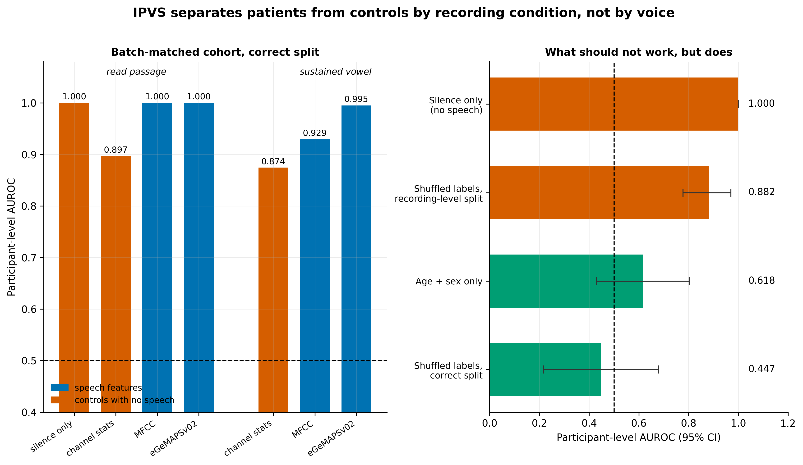

# Parkinson's voice detection — a validity audit of the IPVS corpus

Detecting Parkinson's disease from voice recordings, starting from the free
Italian Parkinson's Voice and Speech corpus (IPVS).

**The intended result is not the result.** Before reporting any performance
figure, this project ran the negative controls that the question requires. Two of
them failed:

- A random forest given **only the silent, non-speech portions** of each recording
  reaches participant-level AUROC **1.000** — under a participant-disjoint split,
  on a cohort restricted to one recording campaign and one sample rate.
- Under **randomly shuffled labels**, a recording-level cross-validation split
  still reports AUROC **0.882**.

Patients and controls in this corpus were recorded under systematically different
conditions. No classification number computed on it — including every number in
this repository — can be attributed to voice. Full evidence in
[`FINDINGS.md`](FINDINGS.md).



## Quick start

```bash
python3.11 -m venv .venv
./.venv/bin/pip install -r requirements.txt
./.venv/bin/pytest tests/ -q          # 24 tests, no corpus needed
```

Then place the corpus (see [Data](#data)) at `data/raw/ipvs/` and:

```bash
make all         # run stages 01-06 as scripts, ~10 min
make notebooks   # same, executing every cell into notebooks/*.ipynb, ~9 min
make figures     # regenerate figures only
```

Or read the executed notebooks, which already carry every output and figure:

```bash
./.venv/bin/jupyter lab notebooks/
```

## Layout

```
notebooks/       executed .ipynb — 51 cells, 12 inline figures, read without running
scripts/         the same six stages as .py, for review, diffs and `make all`
  01_data_cleaning       participant keys, corpus defects, pseudonymisation
  02_eda                 demographics, repeated measures, the acquisition confound
  03_feature_engineering MFCC, eGeMAPSv02, silence and channel controls
  04_modelling_evaluation 3 split arms x 2 cohorts x 2 tasks x 4 feature sets
  05_negative_controls   demographics, permutation, campaign, silence
  06_results             final tables and the comparison with published work
src/
  parsing.py     filename schema, participant key resolution, redaction
  splits.py      the three cross-validation arms
  features.py    feature extractors
  metrics.py     participant-level AUROC, bootstrap by participant, permutation
  experiment.py  the grid runner
  viz.py         figure style and save helper
tests/           24 tests: parsing, split integrity, metric integrity, privacy
results/         tables as csv and parquet
figures/         every figure as png and pdf
docs/METHOD.md   stage-by-stage record of what was computed and why
```

`notebooks/*.ipynb` and `scripts/*.py` are two views of the same six documents,
paired by [jupytext](https://jupytext.readthedocs.io/) via `jupytext.toml`. Edit
either side and run `make sync`. The `.py` side is percent-format plain Python, so
it diffs cleanly in review; the `.ipynb` side carries the executed outputs.

## Method, in brief

Full stage-by-stage account, including the decisions that were reversed mid-way,
in [`docs/METHOD.md`](docs/METHOD.md).

**Participant identification.** IPVS ships no participant identifier. Directory
names are real participant names and are not unique; filenames encode a scrambled
name, birth year and sex. Resolving these correctly reduces "28 patients" to 25,
and `01_data_cleaning` documents six distinct defects that break naive keys.

**Three cross-validation arms**, identical features and estimator, differing only
in which recordings may share a fold:

| arm | grouping | held-out recordings whose participant is also in training |
|---|---|---|
| `A_recording` | none | 85.5% |
| `B_folder_path` | directory path | 9.4% |
| `C_subject_key` | verified participant | 0% |

**Two cohorts.** `full` (25 PD / 22 controls) and `batch_matched` (2017 campaign
only, single sample rate, 18 / 22), because sample rate alone predicts the label
at AUROC 0.70.

**Two controls with no speech in them.** `silence` (MFCC of the non-speech regions)
and `channel` (eight gross properties of the recording chain). Both are the point
of the study, not an afterthought.

**Evaluation** is participant-level throughout: a participant's recordings are
aggregated to one score before scoring, and bootstrap intervals resample
*participants*, never recordings.

## Data

The corpus is not in this repository and must not be committed. Directory names
are real participant names, and filenames encode birth year, sex and the exact
recording timestamp; combined with the diagnostic label that is identifiable
health data regardless of the CC BY 4.0 licence.

Download from IEEE DataPort — "Italian Parkinson's Voice and Speech"
(Dimauro & Girardi, 2019), <https://doi.org/10.21227/aw6b-tg17> — and place it so
that the three group directories sit directly under `data/raw/ipvs/`:

```
data/raw/ipvs/
  28 People with Parkinson's disease/
  22 Elderly Healthy Control/
  15 Young Healthy Control/
```

`.gitignore` blocks `data/` and `*.wav`. Only pseudonymised derivatives leave that
directory: `metadata_public.parquet` carries `PD01`-style identifiers with no
name, path, or timestamp.

## Reproducibility

Dependencies are pinned in `requirements.txt`. Every split is seeded
(`seed=42`, 5 folds × 5 repeats). `results/*.csv` and `figures/*` are regenerated
from scratch by `make all`.

## Citation

If the corpus is used, cite Dimauro & Girardi (2019). If the comparison is used,
cite Klempír, Krupička & Krupil, *Sensors* 24(17):5520 (2024).

## Licence

Code: MIT. The corpus is CC BY 4.0 and is not redistributed here.
