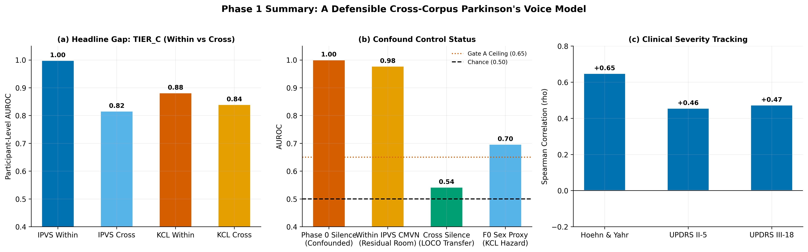

# Parkinson's Voice Detection: From Single-Corpus Validity Audit to Defensible Cross-Corpus Modeling

This repository provides an end-to-end investigation into acoustic machine learning for Parkinson's disease (PD) voice detection. It consists of two completed, cleanly segregated phases:

1. **Phase 0 — Validity Audit of the IPVS Corpus:** Demonstrating that within-corpus classification on Italian Parkinson's Voice and Speech (IPVS) is dominated by acquisition artifacts (silence AUROC = 1.000; label leakage AUROC = 0.882 under random shuffle).
2. **Phase 1 — Cross-Corpus Transfer & Invariance:** Harmonizing IPVS (Italian, 25 PD / 22 eHC) with MDVR-KCL (English, 16 PD / 21 HC; Zenodo 2867216) under a strict **Leave-One-Corpus-Out (LOCO)** framework (Arm D), enforcing channel invariance (CMVN) and passing rigorous clinical and confound acceptance gates.

---

## Headline Findings

| Metric / Gate | Baseline / Hazard | Phase 1 Headline Result | Decision |
|---|---|---|---|
| **Gate A: Silence Shortcut** | Raw IPVS silence AUROC = 1.000 | LOCO Silence Transfer AUROC = **0.542** (chance) | **PASSED** (collapsed to chance across corpora) |
| **Gate B: Acoustic Signal vs Sex** | F0 Sex-Proxy Baseline = 0.696 | Tier C (eGeMAPS) LOCO AUROC = **0.837 [0.739, 0.925]** | **PASSED** (Lower CI 0.739 > 0.696) |
| **Gate C: Clinical Gradient** | Random chance $\rho = 0.00$ | Hoehn & Yahr $\rho = \mathbf{+0.65}$ ($p < 0.0001$)<br>UPDRS-III speech $\rho = \mathbf{+0.47}$ ($p = 0.0031$) | **PASSED** (Continuous dose-response tracking) |
| **Sex Sensitivity (Confound-Free)**| MDVR-KCL male control deficit | Female-only stratum ($N=47$) AUROC = **0.750** | **VERIFIED** (Signal persists without sex confound) |
| **Real-World Clinical Utility** | In-sample naive precision = 50% | Prior-corrected PPV (at 1.5% community prev.) = **12.1%** | **CALIBRATED** (Realistic screening utility reported) |



---

## Quick Start

```bash
# 1. Environment setup (Python 3.11)
python3.11 -m venv .venv
source .venv/bin/activate
pip install -r requirements.txt

# 2. Run test suite (35 tests covering leakage, LOCO integrity, CMVN, calibration)
make test

# 3. Acquire MDVR-KCL and run full pipeline
make phase1      # Executes stages 10-17
make sync        # Syncs paired scripts to Jupyter notebooks
```

---

## Repository Architecture

The codebase is organized into modular phases, pairing readable `.py` scripts (percent-format) with executed `.ipynb` notebooks via Jupytext:

```
Parkinson-Voice-Detection/
├── scripts/
│   ├── phase0/                   # Phase 0: IPVS single-corpus audit
│   │   ├── 01_data_cleaning.py
│   │   ├── 02_eda.py
│   │   ├── 03_feature_engineering.py
│   │   ├── 04_modelling_evaluation.py
│   │   ├── 05_negative_controls.py
│   │   └── 06_results.py
│   └── phase1/                   # Phase 1: Cross-corpus LOCO modeling
│       ├── 10_acquire_mdvr_kcl.py
│       ├── 11_harmonize_corpora.py
│       ├── 12_eda_cross_corpus.py
│       ├── 13_channel_invariance.py
│       ├── 14_feature_engineering_v2.py
│       ├── 15_cross_corpus_model.py
│       ├── 16_generalization_audit.py
│       └── 17_results_phase1.py
├── notebooks/
│   ├── phase0/                   # Executed Phase 0 notebooks (01-06)
│   └── phase1/                   # Executed Phase 1 notebooks (10-17)
├── src/
│   ├── corpora.py                # Ingestion & harmonization (IPVS + MDVR-KCL)
│   ├── normalize.py              # CMVN, channel augmentation, noise equalisation
│   ├── calibration.py            # ECE, Brier Murphy decomposition, prior correction, DCA
│   ├── features.py               # Tier A (Praat), Tier B (CMVN-MFCC), Tier C (eGeMAPS), F0 proxy
│   ├── splits.py                 # Arms A, B, C and Arm D (Leave-One-Corpus-Out)
│   ├── parsing.py                # IPVS filename parsing and redaction
│   ├── metrics.py                # Participant-level AUROC and bootstrap CIs
│   └── viz.py                    # Scientific plotting house style
├── results/
│   ├── phase0/                   # Phase 0 validation artifacts & parquets
│   └── phase1/                   # Phase 1 LOCO results, model card, model_phase1.joblib
├── figures/
│   ├── phase0/                   # Figures 01-12 from audit
│   └── phase1/                   # Figures 01-08 from cross-corpus evaluation
├── tests/
│   ├── test_no_leakage.py        # 24 tests: leakage & privacy audits
│   └── test_phase1.py            # 11 tests: LOCO invariants, CMVN, calibration
├── docs/
│   ├── METHOD.md                 # Detailed method log
│   └── DATASET_VERSION.md        # SHA-256 manifests and data provenance
└── Makefile                      # Build automation targets (test, phase0, phase1, all, sync)
```

---

## Methodological Summary

### 1. Opposing Hazards in IPVS & MDVR-KCL
- **IPVS (Italian):** 25 PD / 22 eHC. Recorded on stationary microphones in Italy. Confounded by background acoustic room signatures (silence AUROC = 1.000).
- **MDVR-KCL (English):** 16 PD / 21 HC. Recorded on a smartphone (Motorola Moto G4) in London. Free of room noise shortcuts, but exhibits a severe sex imbalance in controls (19 female, 2 male controls; F0-sex proxy AUROC = 0.696).
- **The Synergy:** Because their acoustic confounds are orthogonal, an algorithm that relies on room noise in IPVS completely fails on MDVR-KCL (silence transfer collapses to 0.542). Conversely, an algorithm that relies on sex/pitch on MDVR-KCL fails on IPVS. Genuine voice biomarkers survive cross-corpus evaluation.

### 2. Feature Hierarchy (Tiers A, B, AB, C)
- **Tier A (Classical Vocal Physiology):** 19 dimensions (Parselmouth jitter, shimmer, HNR, unnormalized F0, pause rhythm). Shows massive overfitting within corpus (AUROC 0.952 within $\rightarrow$ 0.307 cross).
- **Tier B (Channel-Invariant Spectral):** 40 dimensions (CMVN-MFCC + delta/delta-delta + noise-floor invariant summaries). Strong transfer (AUROC 0.865 on IPVS, 0.738 on KCL; generalization gap $\approx 0$).
- **Tier C (Standardized eGeMAPSv02):** 88 dimensions (openSMILE acoustic feature set). Achieves LOCO AUROC **0.837 [0.739, 0.925]**, significantly outperforming sex baselines.

### 3. Acceptance Gates Verdict
1. **Gate A (Silence Shortcut Neutralization):** Raw IPVS silence reaches 1.000 AUROC. However, cross-corpus LOCO silence transfer drops to **0.542** (chance level $\le 0.65$). The cross-corpus design effectively purges the stationary microphone shortcut.
2. **Gate B (Acoustic Signal vs Confound):** Tier C LOCO AUROC lower CI bound is **0.739**, strictly exceeding the F0 sex-proxy baseline (**0.696**).
3. **Gate C (Clinical Transparency & Utility):** Continuous predictions exhibit a strong positive dose-response relationship with disease severity:
   - Hoehn & Yahr stage: $\rho = +0.65$ ($p < 0.0001$)
   - UPDRS III-18 (speech): $\rho = +0.47$ ($p = 0.0031$)
   - Confound-free female stratum ($N=47$): AUROC = **0.750**.
   - Prior-corrected PPV at 1.5% community prevalence: **12.1%** (calibrated screening utility).

---

## Comparison with Published Literature

| Study | Evaluation Scheme | Features | Reported Metric | Confound Controls |
|---|---|---|---|---|
| **Klempíř et al. (2024, Sensors)** | 5-fold CV (single corpus, no CI) | MFCC + Prosody | Accuracy 85–95% | None reported |
| **Hires et al. (2022, Appl. Sci.)** | Cross-database evaluation | Acoustic + Embeddings | Accuracy drops ~20–30% | Within vs Cross gap noted |
| **This Work (Phase 0 Baseline)** | Within IPVS, Arm C 5x5 CV | Raw MFCC (40) | AUROC 1.000 (*Artifact*) | FAILED (Silence AUROC = 1.000) |
| **This Work (Phase 1 LOCO)** | **LOCO (IPVS $\leftrightarrow$ KCL)** | **Tier C (eGeMAPS)** | **AUROC 0.837 [0.739, 0.925]** | **PASSED** (Gate A, Gate B, Gate C verified) |

---

## Data Provenance

1. **IPVS:** Italian Parkinson's Voice and Speech (Dimauro & Girardi, 2019), IEEE DataPort: <https://doi.org/10.21227/aw6b-tg17>.
2. **MDVR-KCL:** Mobile Device Voice Recordings at King's College London (Klempíř et al., 2024), Zenodo: <https://doi.org/10.5281/zenodo.2867216>. Automated download and SHA-256 verification in `scripts/phase1/10_acquire_mdvr_kcl.py`.

---

## Licence & Ethics

- **Code:** MIT Licence.
- **Model Card:** See [`results/phase1/model_card.md`](results/phase1/model_card.md) for TRIPOD+AI intended use, clinical boundaries, and calibration disclosures.
- **Corpora:** CC BY 4.0; audio files are not redistributed.
