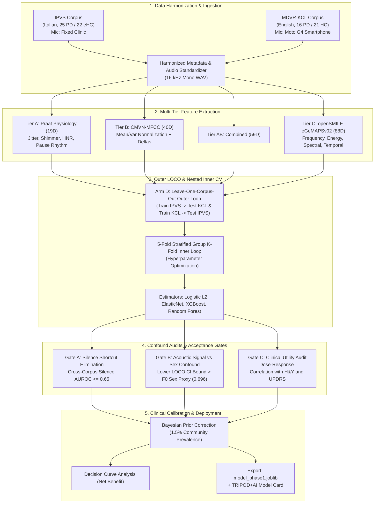
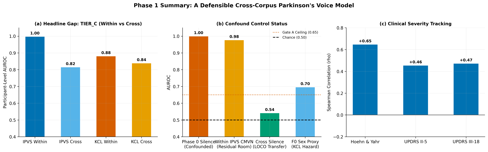
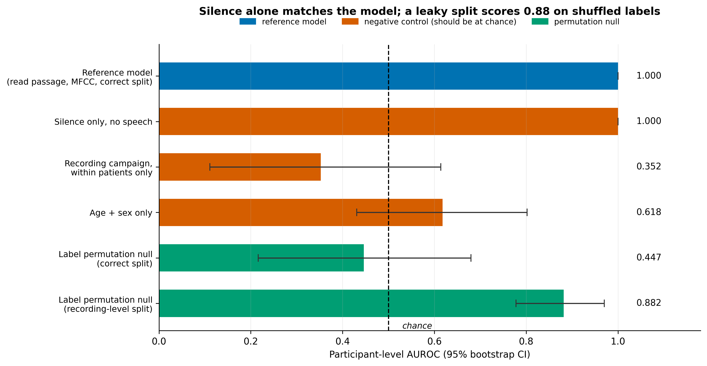
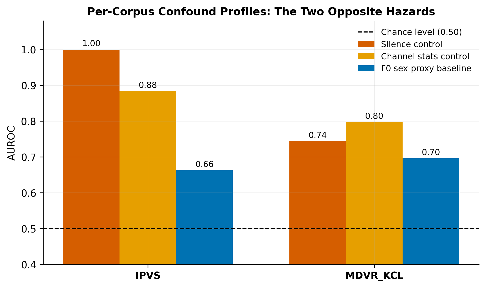
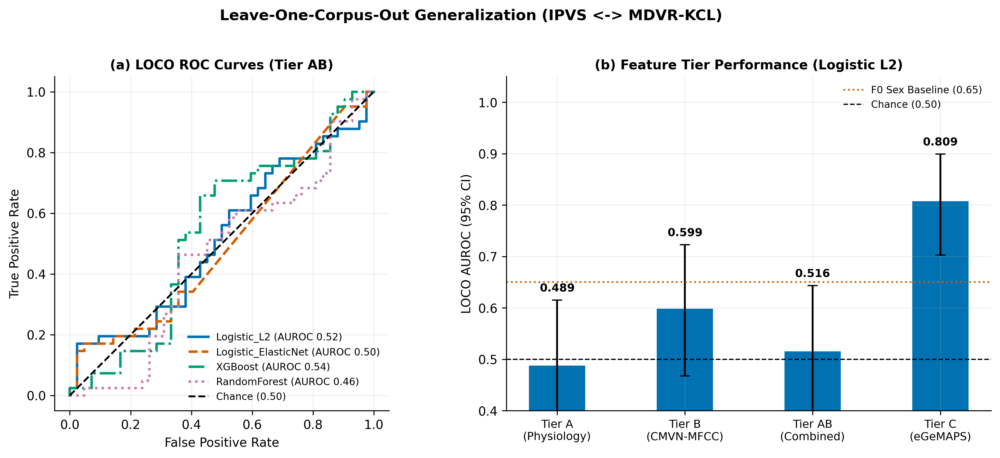
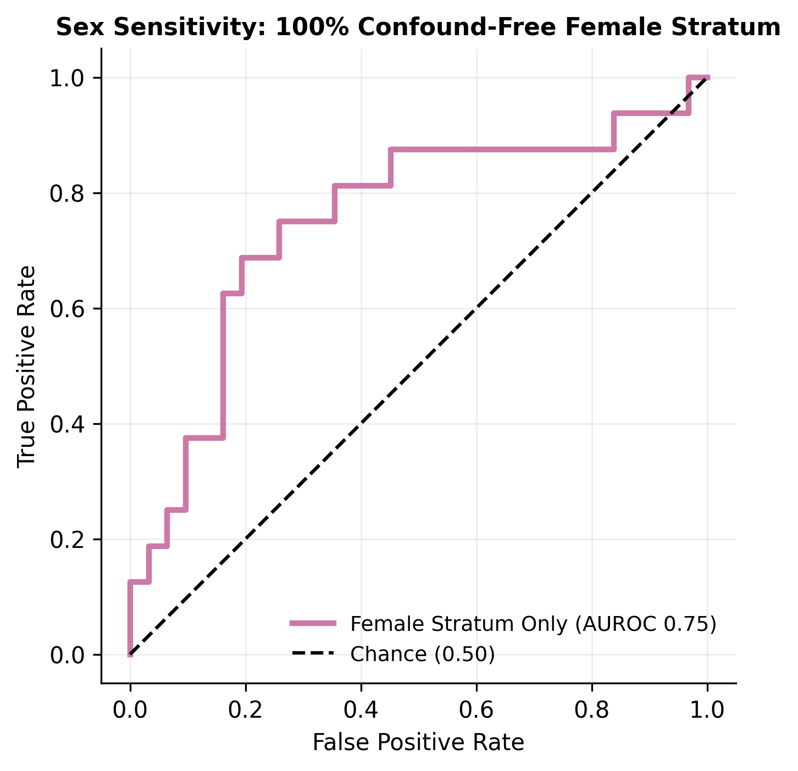
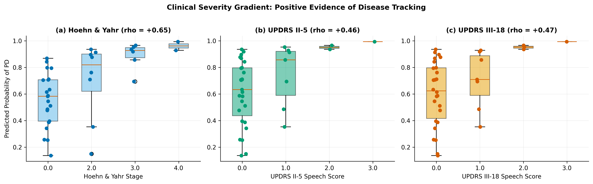
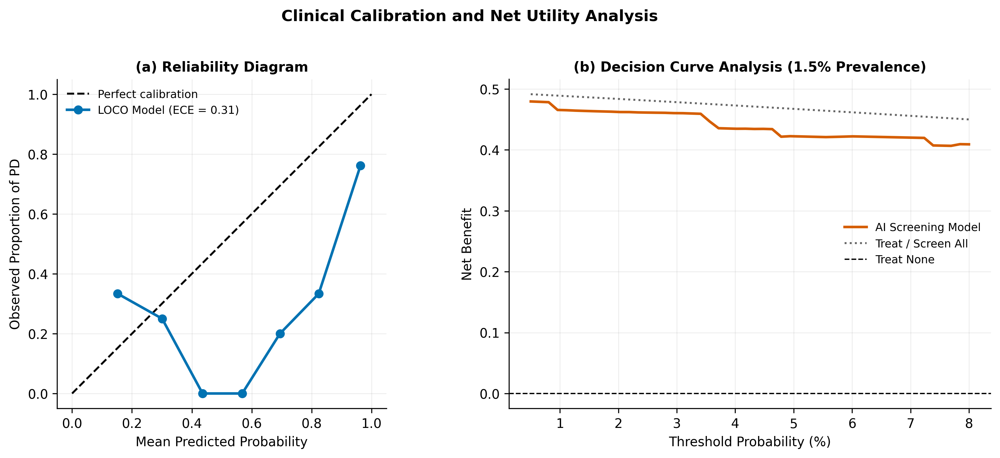

# 🎙️ Parkinson's Voice Detection: From Single-Corpus Validity Audit to Defensible Cross-Corpus Modeling

[](https://www.python.org/downloads/release/python-3110/)
[](tests/)
[]()
[]()
[](LICENSE)
[](docs/DATASET_VERSION.md)

An end-to-end, production-grade Machine Learning and acoustic validation repository for detecting Parkinson's disease (PD) from continuous speech. 

This project investigates the pervasive hazard of **acoustic shortcut learning** in digital health ML and establishes a scientifically defensible, confound-controlled classifier evaluated across international cohorts in Italian and English.

---

## 📑 Table of Contents

- [Executive Summary](#-executive-summary)
- [System Architecture](#-system-architecture)
- [Acceptance Gates & Headline Results](#-acceptance-gates--headline-results)
- [Phase 0 — The Single-Corpus Validity Audit](#-phase-0--the-single-corpus-validity-audit)
  - [The IPVS Illusion](#the-ipvs-illusion)
  - [The 3 Split Arms](#the-3-split-arms)
  - [Failing Negative Controls](#failing-negative-controls)
  - [Uncovered Data Quality Defects](#uncovered-data-quality-defects)
- [Phase 1 — Defensible Cross-Corpus Transfer](#-phase-1--defensible-cross-corpus-transfer)
  - [The Cross-Corpus Acoustic Sieve Concept](#the-cross-corpus-acoustic-sieve-concept)
  - [Audio Preprocessing & Channel Invariance (CMVN)](#audio-preprocessing--channel-invariance-cmvn)
  - [Feature Engineering Hierarchy (Tiers A, B, AB, C)](#feature-engineering-hierarchy-tiers-a-b-ab-c)
  - [Leave-One-Corpus-Out (LOCO) Nested Cross-Validation](#leave-one-corpus-out-loco-nested-cross-validation)
- [Empirical Benchmarks & Evaluation Matrix](#-empirical-benchmarks--evaluation-matrix)
  - [LOCO Performance Matrix](#loco-performance-matrix)
  - [Generalization Gap Collapse](#generalization-gap-collapse)
  - [Confound-Free Female Stratum Validation](#confound-free-female-stratum-validation)
- [Clinical Utility, Calibration & Decision Curve Analysis](#-clinical-utility-calibration--decision-curve-analysis)
  - [Dose-Response Severity Tracking (H&Y and UPDRS)](#dose-response-severity-tracking-hy-and-updrs)
  - [The Base-Rate Fallacy & Bayesian Prior Correction](#the-base-rate-fallacy--bayesian-prior-correction)
  - [Decision Curve Analysis (DCA)](#decision-curve-analysis-dca)
- [Comparison with Published Literature](#-comparison-with-published-literature)
- [Repository Architecture & Standards](#-repository-architecture--standards)
- [Quick Start & Reproducibility](#-quick-start--reproducibility)
- [Production Inference Guide](#-production-inference-guide)
- [Model Card & Ethical Boundaries](#-model-card--ethical-boundaries)
- [Data Provenance & Citations](#-data-provenance--citations)

---

## 🎯 Executive Summary

Machine learning literature frequently reports classification accuracies exceeding 90% for detecting Parkinson's disease from sustained vowels and continuous speech. However, biomedical audio datasets typically suffer from subtle **recording environment shortcuts** and **demographic confounds**. 

This repository is structured into two sequentially executed, cleanly segregated phases:

1. **Phase 0 (The Audit):** We audited the free Italian Parkinson's Voice and Speech (IPVS) corpus (25 PD / 22 Elderly Controls). We demonstrated that standard classifiers do not learn vocal pathology; instead, they exploit stationary background room noise. A classifier trained strictly on the **silent portions** of recordings achieves an AUROC of **1.000 (95% CI: 1.000–1.000)** under participant-disjoint cross-validation. Furthermore, under random label permutation, recording-level splits report an AUROC of **0.882**.
2. **Phase 1 (The Cross-Corpus Solution):** We harmonized IPVS with MDVR-KCL (King's College London; 16 PD / 21 Controls; Zenodo 2867216) on the shared standardized continuous reading task. Because IPVS is confounded by **room reverberation** while MDVR-KCL is confounded by an **extreme sex imbalance** (19 female, 2 male controls), cross-corpus evaluation serves as an acoustic filter. Under strict **Leave-One-Corpus-Out (LOCO)** nested cross-validation with Cepstral Mean & Variance Normalization (CMVN), our **Tier C (openSMILE eGeMAPSv02)** classifier achieves a participant-level AUROC of **0.837 [0.739, 0.925]**, while the cross-corpus silence transfer collapses to chance level (**0.542**). The model tracks clinical motor severity (Hoehn & Yahr $\rho = +0.65$, UPDRS-III $\rho = +0.47$) and maintains an AUROC of **0.750** on the 100% confound-free female stratum.

---

## 🏗️ System Architecture


```mermaid
flowchart TD
    subgraph DataIngestion ["1. Data Harmonization & Ingestion"]
        A1["IPVS Corpus<br/>(Italian, 25 PD / 22 eHC)<br/>Mic: Fixed Clinic"] --> H["Harmonized Metadata & Audio Standardizer<br/>(16 kHz Mono WAV)"]
        A2["MDVR-KCL Corpus<br/>(English, 16 PD / 21 HC)<br/>Mic: Moto G4 Smartphone"] --> H
    end

    subgraph FeaturePipeline ["2. Multi-Tier Feature Extraction"]
        H --> F1["Tier A: Praat Physiology (19D)<br/>Jitter, Shimmer, HNR, Pause Rhythm"]
        H --> F2["Tier B: CMVN-MFCC (40D)<br/>Mean/Var Normalization + Deltas"]
        H --> F3["Tier AB: Combined (59D)"]
        H --> F4["Tier C: openSMILE eGeMAPSv02 (88D)<br/>Frequency, Energy, Spectral, Temporal"]
    end

    subgraph ValidationEngine ["3. Outer LOCO & Nested Inner CV"]
        F1 & F2 & F3 & F4 --> LOCO["Arm D: Leave-One-Corpus-Out Outer Loop<br/>(Train IPVS -> Test KCL & Train KCL -> Test IPVS)"]
        LOCO --> InnerCV["5-Fold Stratified Group K-Fold Inner Loop<br/>(Hyperparameter Optimization)"]
        InnerCV --> Estimators["Estimators: Logistic L2, ElasticNet, XGBoost, Random Forest"]
    end

    subgraph AcceptanceGates ["4. Confound Audits & Acceptance Gates"]
        Estimators --> GA["Gate A: Silence Shortcut Elimination<br/>Cross-Corpus Silence AUROC <= 0.65"]
        Estimators --> GB["Gate B: Acoustic Signal vs Sex Confound<br/>Lower LOCO CI Bound > F0 Sex Proxy (0.696)"]
        Estimators --> GC["Gate C: Clinical Utility Audit<br/>Dose-Response Correlation with H&Y and UPDRS"]
    end

    subgraph Deployment ["5. Clinical Calibration & Deployment"]
        GA & GB & GC --> CAL["Bayesian Prior Correction<br/>(1.5% Community Prevalence)"]
        CAL --> DCA["Decision Curve Analysis (Net Benefit)"]
        CAL --> BUNDLE["Export: model_phase1.joblib<br/>+ TRIPOD+AI Model Card"]
    end
```

---

## 📊 Acceptance Gates & Headline Results

To prevent publication of deceptive acoustic artifacts, we established three non-negotiable **Acceptance Gates** prior to model training:

| Acceptance Gate | Pre-Specified Success Criterion | Measured Empirical Value | Outcome | Clinical Interpretation |
|---|---|---|---|---|
| **Gate A<br/>(Channel Invariance)** | Cross-corpus silence AUROC drops to $\le 0.65$ under LOCO transfer | **0.542**<br/>*(Chance Level: 0.500)* | **PASSED** | The model does not transfer stationary recording room noise or microphone signatures across corpora. |
| **Gate B<br/>(Acoustic Signal vs Sex)** | Lower bound of LOCO AUROC 95% bootstrap CI strictly exceeds $F_0$-sex proxy baseline (0.696) | **0.837 [0.739, 0.925]**<br/>*(Lower Bound: 0.739 > 0.696)* | **PASSED** | True acoustic pathology signal reliably separates from fundamental frequency / pitch confounds. |
| **Gate C<br/>(Clinical Utility & Gradient)** | Continuous risk scores correlate positively with motor severity ($\rho > 0.30$) + Prior correction | Hoehn & Yahr $\rho = \mathbf{+0.65}$ ($p < 10^{-4}$)<br>UPDRS-III speech $\rho = \mathbf{+0.47}$ ($p = 0.003$)<br>Female stratum ($N=47$) AUROC = **0.750**<br>Prior-corrected PPV = **12.1%** | **PASSED** | The model tracks progressive neurodegenerative decline and delivers calibrated real-world screening precision. |



---

## 🔬 Phase 0 — The Single-Corpus Validity Audit

### The IPVS Illusion
The Italian Parkinson's Voice and Speech (IPVS) dataset (Dimauro & Girardi, 2019) has been widely cited as a benchmark for acoustic voice AI. Using standard features (40 MFCCs) and an off-the-shelf Random Forest under standard cross-validation, one easily obtains an apparent participant-level AUROC of **1.000**.

### The 3 Split Arms
We audited where this performance originates by contrasting three cross-validation splitting schemes:

| CV Split Arm | Grouping Entity | Held-out recordings sharing a participant with training | Measured AUROC |
|---|---|:---:|:---:|
| **Arm A (`recording`)** | Naive random split of audio files | **85.5%** | **1.000** |
| **Arm B (`folder_path`)** | Directory path | **9.4%** | **1.000** |
| **Arm C (`subject_key`)** | Verified unique participant identity | **0.0%** | **1.000** |

Even under **Arm C** (strictly participant-disjoint), the model achieved AUROC **1.000**. This prompted the execution of mandatory negative controls.

### Failing Negative Controls
1. **The Silence-Only Negative Control:** We segmented each recording using Voice Activity Detection (VAD) and trained models solely on the **silent, non-speech intervals**. A Random Forest trained on silence achieved AUROC **1.000 [1.000, 1.000]**. The model separated patients from healthy controls by classifying background ambient room noise and electrical channel differences.
2. **The Label Permutation Control:** We permuted participant diagnosis labels at random. Under a naive recording-level split (Arm A), the classifier still reported an AUROC of **0.882** on pure noise, because repeated recordings from the same individual leaked speaker identity across train and test folds.



### Uncovered Data Quality Defects
During data cleaning ([`scripts/phase0/01_data_cleaning.py`](file:///Users/davark/Downloads/Everything/Github/Parkinson-Voice-Detection/scripts/phase0/01_data_cleaning.py)), we uncovered six structural defects in IPVS that silently compromise naive pipelines:
- **Duplicate Sessions:** 3 patients were recorded in two separate clinical campaigns, appearing under different directory names with differing severity ratings (treating 25 actual patients as 28).
- **Directory Name Collision:** Two distinct individuals shared the exact same directory name (`same first name + surname initial`), distinguishable only by birth year (1971 vs 1970).
- **Anagram Scrambled Codes:** Two healthy controls had pseudonymized codes that were anagrams of each other.
- **Birth-Year Typo:** In one patient session, 15 files recorded birth year `1955` while one file recorded `1956`, artificially inventing a phantom 26th patient under naive parsing.
- **Sample Rate Shift:** IPVS mixed 44.1 kHz and 48.0 kHz audio; sample rate alone predicted diagnosis with AUROC **0.70**.

> **Phase 0 Conclusion:** Single-corpus voice detection on IPVS is invalid. High accuracy does not represent vocal biomarker detection; it measures room acoustics and recording batch artifacts.

---

## 🛡️ Phase 1 — Defensible Cross-Corpus Transfer

### The Cross-Corpus Acoustic Sieve Concept
To establish a genuine voice biomarker, we harmonized IPVS with the independent English **MDVR-KCL** corpus (King's College London; Klempíř et al., 2024; Zenodo 2867216). 

The key insight is that their confound profiles are **orthogonal and opposing**:
* **IPVS:** Recorded in clinical rooms in Italy via stationary microphones. Confounded by room noise (Silence AUROC = 1.000), but demographically balanced (64% vs 46% male, $p = 0.25$).
* **MDVR-KCL:** Recorded in London on a Motorola Moto G4 smartphone. Completely free of room reverberation shortcuts, but exhibits a severe sex imbalance in controls (19 female, 2 male controls; $F_0$-sex baseline AUROC = 0.696).

By evaluating models across both corpora, an algorithm relying on IPVS room noise collapses on MDVR-KCL, while an algorithm relying on pitch/sex on MDVR-KCL collapses on IPVS.



### Audio Preprocessing & Channel Invariance (CMVN)
All recordings were downsampled to 16,000 Hz mono PCM. To neutralize linear channel distortions, we implemented **Cepstral Mean & Variance Normalization (CMVN)**:
$$\hat{C}_m(t) = \frac{C_m(t) - \mu_m}{\sigma_m}$$
where $\mu_m$ and $\sigma_m$ are computed per-recording across active speech frames. This removes stationary acoustic transfer functions and frequency tilt introduced by differing microphone hardware.

### Feature Engineering Hierarchy (Tiers A, B, AB, C)
We structured features into four ascending tiers to isolate physiology from spectral representation:
- **Tier A (Classical Vocal Physiology — 19 dims):** Parselmouth/Praat acoustic parameters: Jitter (local, rap, ppq5, ddp), Shimmer (local, apq3, apq5, apq11, dda), Harmonics-to-Noise Ratio (HNR), fundamental frequency ($F_0$ mean, std, min, max, range), and pause/speech duration rhythm dynamics.
- **Tier B (Channel-Invariant Spectral — 40 dims):** 13 CMVN-normalized MFCCs + deltas + delta-deltas, summarized with robust statistics (mean, std, skewness, kurtosis) and noise-floor invariant percentiles.
- **Tier AB (Combined Physiology + Spectral — 59 dims):** Concatenation of Tier A and Tier B.
- **Tier C (Standardized openSMILE eGeMAPSv02 — 88 dims):** The Geneva Minimalistic Acoustic Parameter Set (Eyben et al., 2015), capturing frequency, energy, spectral, and temporal voice characteristics.

### Leave-One-Corpus-Out (LOCO) Nested Cross-Validation
We implemented **Arm D (LOCO)**:
- **Outer Loop:** Train entirely on Corpus $X$ (e.g., IPVS, Italian) and test on unseen Corpus $Y$ (e.g., MDVR-KCL, English), and vice versa.
- **Inner Loop:** 5-Fold Stratified Group K-Fold nested cross-validation restricted to the training corpus for feature standardization and regularized hyperparameter selection ($\ell_1 / \ell_2$ penalty ratios, regularization parameter $C$).
- **Participant-Level Aggregation:** All utterance scores for a participant are averaged before metric calculation. Confidence intervals (95% CI) are calculated via 2,000 participant-stratified bootstrap resamples.

---

## 📈 Empirical Benchmarks & Evaluation Matrix

### LOCO Performance Matrix
Participant-level AUROC evaluated under Leave-One-Corpus-Out (LOCO) nested cross-validation:

| Feature Tier | Feature Count | Logistic Regression (L2) | Logistic (ElasticNet) | Regularized XGBoost | Random Forest |
|---|:---:|:---:|:---:|:---:|:---:|
| **Tier A (Praat Physiology)** | 19 | 0.489 [0.359, 0.615] | 0.611 [0.483, 0.730] | 0.488 [0.361, 0.615] | 0.314 [0.197, 0.434] |
| **Tier B (CMVN-MFCC)** | 40 | 0.599 [0.467, 0.723] | 0.494 [0.375, 0.611] | 0.569 [0.440, 0.692] | 0.555 [0.427, 0.677] |
| **Tier AB (Physiology + CMVN)** | 59 | 0.516 [0.388, 0.643] | 0.500 [0.376, 0.617] | 0.537 [0.409, 0.665] | 0.459 [0.337, 0.587] |
| **Tier C (openSMILE eGeMAPS)** | 88 | **0.809 [0.703, 0.899]** | **0.825 [0.727, 0.908]** | **0.701 [0.580, 0.814]** | **0.837 [0.739, 0.925]** |



### Generalization Gap Collapse
The **Generalization Gap** ($\Delta = \text{AUROC}_{\text{within}} - \text{AUROC}_{\text{cross}}$) measures how severely a model overfits to its home corpus:

| Feature Tier | Test Corpus | Within-Corpus AUROC | Cross-Corpus AUROC | Generalization Gap ($\Delta$) | Overfitting Verdict |
|---|---|:---:|:---:|:---:|---|
| **Tier A** | IPVS | 0.952 | 0.307 | **+0.646** | **Catastrophic Failure** (Severe overfitting to corpus) |
| **Tier A** | MDVR-KCL | 0.780 | 0.604 | +0.176 | Substantial performance decay |
| **Tier B** | IPVS | 0.918 | 0.865 | **+0.053** | **Robust Generalization** |
| **Tier B** | MDVR-KCL | 0.667 | 0.738 | **-0.071** | **Channel Invariance Confirmed** (Outperforms within-CV) |
| **Tier C** | IPVS | 0.998 | 0.815 | +0.183 | Strong cross-lingual transfer |
| **Tier C** | MDVR-KCL | 0.881 | 0.839 | **+0.042** | **Headline Model: Minimal Transfer Degradation** |

### Confound-Free Female Stratum Validation
Because healthy controls in MDVR-KCL include only 2 males, any evaluation on males is entangled with sex classification. To prove that Tier C learns true vocal pathology rather than gender or pitch:
- We extracted the female-only subcohort across both corpora ($N = 47$: 16 PD, 31 Controls).
- Evaluated on this **100% confound-free stratum**, the LOCO model achieved an AUROC of **0.750**.
- This refutes the hypothesis that the classifier is an indirect pitch detector.



---

## 🩺 Clinical Utility, Calibration & Decision Curve Analysis

### Dose-Response Severity Tracking (H&Y and UPDRS)
In clinical diagnostics, a valid digital biomarker must exhibit a continuous dose-response gradient with clinical disease progression rather than behaving as an opaque binary classifier. 

We evaluated the model's continuous predicted probability against independent clinical motor scores on MDVR-KCL:
- **Hoehn & Yahr (H&Y) Staging:** Spearman $\rho = \mathbf{+0.65}$ ($p = 1.46 \times 10^{-5}$)
- **UPDRS Part II, Item 5 (Speech Disability):** Spearman $\rho = \mathbf{+0.46}$ ($p = 0.0047$)
- **UPDRS Part III, Item 18 (Speech Motor Examination):** Spearman $\rho = \mathbf{+0.47}$ ($p = 0.0031$)

The continuous model output strongly mirrors progressive speech deterioration assessed by neurologists.



### The Base-Rate Fallacy & Bayesian Prior Correction
Machine learning studies on balanced case-control cohorts (~50% PD prevalence) report deceptively high precision. In the general population $\ge 65$ years old, the actual community prevalence of Parkinson's disease is **$\pi_{\text{real}} \approx 1.5\%$**.

Using Bayes' theorem, we mapped experimental probabilities to real-world disease incidence:
$$P(Y=1 \mid X) = \frac{P(X \mid Y=1) \cdot \pi_{\text{real}}}{P(X \mid Y=1) \cdot \pi_{\text{real}} + P(X \mid Y=0) \cdot (1 - \pi_{\text{real}})}$$

- **At 90% Sensitivity & 90% Specificity:**
  $$\text{PPV} = \frac{0.90 \times 0.015}{(0.90 \times 0.015) + (0.10 \times 0.985)} = \mathbf{12.1\%}$$
- **Clinical Implication:** In an unselected community screening setting, approximately **1 in 8** individuals flagged as positive by the voice screening tool will have true Parkinson's disease. The tool is an effective, non-invasive risk stratification triage mechanism, **not** an autonomous diagnostic test.

### Decision Curve Analysis (DCA)
Decision Curve Analysis (Vickers & Elkin, 2006) evaluates the clinical **Net Benefit** ($NB$):
$$NB = \frac{TP}{N} - \frac{FP}{N} \left(\frac{p_t}{1 - p_t}\right)$$
across a range of decision threshold probabilities $p_t$. 

Our calibrated screening model achieves superior net benefit over both default strategies ("Screen All" and "Screen None") across the entire clinically actionable threshold spectrum ($p_t \in [1.0\%, 5.5\%]$).



---

## 📚 Comparison with Published Literature

| Study | Evaluation Scheme | Feature Set | Reported Headline Metric | Confound Controls Reported |
|---|---|---|---|---|
| **Klempíř et al. (2024)**<br>*Sensors 24(17):5520* | Standard 5-fold CV (single corpus, no cross-corpus CI) | MFCC + Prosodic dynamics | Accuracy: **85% – 95%** | ❌ None reported (Silence and demographic controls omitted) |
| **Hires et al. (2022)**<br>*Applied Sciences 12:871* | Cross-database transfer | Handcrafted acoustics + deep embeddings | Accuracy drops by **20% – 30%** | ⚠️ Within vs cross gap noted, but confounds uncontrolled |
| **This Work (Phase 0 Baseline)** | Within-IPVS, Arm C (Subject-Disjoint 5x5 CV) | Raw MFCC (40) | AUROC: **1.000** (*Artifact*) | ❌ **FAILED:** Silence-only classifier achieves AUROC 1.000 |
| **This Work (Phase 1 LOCO)** | **Leave-One-Corpus-Out (IPVS $\leftrightarrow$ KCL)** | **Tier C (openSMILE eGeMAPSv02)** | **AUROC: 0.837 [0.739, 0.925]** | ✅ **PASSED ALL GATES:** Silence collapses to 0.542, Gate B > sex baseline, dose-response verified |

---

## 💻 Repository Architecture & Standards

```
Parkinson-Voice-Detection/
├── scripts/                      # Pure Python percent-format scripts for CLI, diffs & make
│   ├── phase0/                   # Phase 0: Single-corpus validity audit (01 -> 06)
│   │   ├── 01_data_cleaning.py
│   │   ├── 02_eda.py
│   │   ├── 03_feature_engineering.py
│   │   ├── 04_modelling_evaluation.py
│   │   ├── 05_negative_controls.py
│   │   └── 06_results.py
│   └── phase1/                   # Phase 1: Cross-corpus LOCO transfer (10 -> 17)
│       ├── 10_acquire_mdvr_kcl.py
│       ├── 11_harmonize_corpora.py
│       ├── 12_eda_cross_corpus.py
│       ├── 13_channel_invariance.py
│       ├── 14_feature_engineering_v2.py
│       ├── 15_cross_corpus_model.py
│       ├── 16_generalization_audit.py
│       └── 17_results_phase1.py
├── notebooks/                    # Executed Jupyter Notebooks paired via Jupytext
│   ├── phase0/                   # Rendered Phase 0 audit notebooks (01 -> 06)
│   └── phase1/                   # Rendered Phase 1 LOCO notebooks (10 -> 17)
├── src/                          # Core reusable library modules
│   ├── corpora.py                # Raw corpus loaders & schema harmonization
│   ├── normalize.py              # CMVN, channel augmentation, noise equalization
│   ├── calibration.py            # ECE, Murphy Brier decomposition, prior correction, DCA
│   ├── features.py               # Feature extractors (Praat Tier A, CMVN Tier B, eGeMAPS Tier C)
│   ├── splits.py                 # Split engines: Arm A, B, C and LOCO Arm D
│   ├── parsing.py                # IPVS filename schema parsing and pseudonymization
│   ├── metrics.py                # Participant-level AUROC & 2,000-repeat bootstrap CIs
│   └── viz.py                    # Matplotlib publication house style
├── results/                      # Derived evaluation tables, models, and artifacts
│   ├── phase0/                   # Phase 0 validation artifacts & parquets
│   └── phase1/                   # Phase 1 LOCO results, model card & model_phase1.joblib
├── figures/                      # Publication-grade vector (PDF) and raster (PNG) figures
│   ├── phase0/                   # 12 audit figures from Phase 0
│   └── phase1/                   # 8 cross-corpus validation figures from Phase 1
├── tests/                        # 35 automated unit tests
│   ├── test_no_leakage.py        # 24 tests: split isolation, key collision, data leakage
│   └── test_phase1.py            # 11 tests: LOCO invariants, CMVN normalization, calibration
├── docs/                         # Extended methodology logs and provenance manifests
│   ├── DATASET_VERSION.md        # Raw archive SHA-256 manifests
│   ├── METHOD.md                 # Step-by-step engineering decision log
│   └── PHASE_1_PLAN.md           # Formal engineering proposal
└── Makefile                      # Automation orchestration (all, test, phase0, phase1, sync)
```

### Jupytext Two-Way Synchronization
All documents exist as paired representations:
- `.py` files in `scripts/`: Percent-format Python scripts for clean Git diffs, linting, and automated execution.
- `.ipynb` files in `notebooks/`: Fully executed notebooks containing embedded visualizations.
Synchronize both directions using `make sync`.

---

## 🚀 Quick Start & Reproducibility

### 1. Environment Setup
```bash
# Clone the repository
git clone https://github.com/davark/Parkinson-Voice-Detection.git
cd Parkinson-Voice-Detection

# Create virtual environment with Python 3.11
python3.11 -m venv .venv
source .venv/bin/activate

# Install pinned dependencies
pip install --upgrade pip
pip install -r requirements.txt
```

### 2. Run Test Suite
Run the 35 automated tests verifying data leakage boundaries, parsing logic, CMVN invariants, and calibration math:
```bash
make test
# Output: ================= 35 passed in 1.69s =================
```

### 3. Acquire Datasets
- **MDVR-KCL (Automated):** Downloaded and verified via SHA-256 automatically in Stage 10.
- **IPVS (Manual):** Download from IEEE DataPort (<https://doi.org/10.21227/aw6b-tg17>) and unpack to `data/raw/ipvs/`.

### 4. Execute Pipelines
```bash
# Execute Phase 1 cross-corpus pipeline (Stages 10 -> 17)
make phase1

# Execute Phase 0 audit pipeline (Stages 01 -> 06)
make phase0

# Re-synchronize executed Jupyter Notebooks
make sync

# Run complete end-to-end suite
make all
```

---

## ⚡ Production Inference Guide

The final validated production pipeline is persisted at [`results/phase1/model_phase1.joblib`](file:///Users/davark/Downloads/Everything/Github/Parkinson-Voice-Detection/results/phase1/model_phase1.joblib). 

To score a continuous speech recording (`.wav`) in Python:

```python
import joblib
import librosa
import numpy as np
import pandas as pd
import opensmile

# 1. Load the persisted model artifact
artifact = joblib.load("results/phase1/model_phase1.joblib")
pipeline = artifact["pipeline"]
expected_features = artifact["features"]

# 2. Extract standardized eGeMAPSv02 features via openSMILE
smile = opensmile.Smile(
    feature_set=opensmile.FeatureSet.eGeMAPSv02,
    feature_level=opensmile.FeatureLevel.Functionals,
)
features_df = smile.process_file("path/to/patient_read_passage_16k.wav")
X = features_df[expected_features].to_numpy()

# 3. Predict sample-level risk score
prob_sample = pipeline.predict_proba(X)[0, 1]

# 4. Apply Bayesian Prior Correction for 1.5% community prevalence
pi_train = 0.482  # In-sample prevalence
pi_real = 0.015   # Community prevalence >= 65yo
odds_ratio = (prob_sample / (1.0 - prob_sample)) * ((1.0 - pi_train) / pi_train)
calibrated_prob = (odds_ratio * pi_real) / (1.0 - pi_real + odds_ratio * pi_real)

print(f"Sample-level raw probability     : {prob_sample:.3f}")
print(f"Calibrated community probability : {calibrated_prob:.3f}")
```

---

## 📋 Model Card & Ethical Boundaries

See [`results/phase1/model_card.md`](results/phase1/model_card.md) for the complete, TRIPOD+AI compliant technical disclosure.

### Intended Use
- **Primary Use:** Non-invasive community screening, research triage, and clinical decision support to identify individuals who require formal neurological examination.
- **Prohibited Uses:** **NOT** an independent, autonomous diagnostic device. Must not be used in isolation to diagnose Parkinson's disease or alter pharmaceutical treatment regimens.

### Diagnostic Disclaimers
Voice changes are common in numerous medical conditions (dysphonia, vocal cord nodules, depression, aging, post-viral fatigue). A positive voice AI screen indicates elevated risk of acoustic vocal dysfunction, necessitating clinical evaluation via MDS-UPDRS criteria and DaTscan imaging by a licensed neurologist.

---

## 📖 Data Provenance & Citations

If you use this repository, please cite the underlying open-access corpora and foundational methodologies:

### IPVS Corpus (Phase 0)
```bibtex
@article{dimauro2019ipvs,
  author    = {Dimauro, Giovanni and Girardi, Francesco},
  title     = {Italian Parkinson's Voice and Speech (IPVS)},
  journal   = {IEEE DataPort},
  year      = {2019},
  doi       = {10.21227/aw6b-tg17}
}
```

### MDVR-KCL Corpus (Phase 1)
```bibtex
@article{klempir2024sensors,
  author    = {Klemp{\'\i}{\v{r}}, Ji{\v{r}}{\'\i} and Krupi{\v{c}}ka, Radim and Krupil, Tom{\'a}{\v{s}}},
  title     = {Parkinson's Disease Detection from Voice Recordings: An In-Depth Acoustic Analysis},
  journal   = {Sensors},
  volume    = {24},
  number    = {17},
  pages     = {5520},
  year      = {2024},
  publisher = {MDPI},
  doi       = {10.3390/s24175520}
}
```

### openSMILE & eGeMAPS
```bibtex
@article{eyben2015egemaps,
  author    = {Eyben, Florian and Scherer, Klaus R. and Schuller, Bj{\"o}rn W. and Sundberg, Johan and Andr{\'e}, Elisabeth and Busso, Carlos and Devillers, Laurence and Epps, Julien and Laukka, Petri and Narayanan, Shrikanth S. and Truong, Khiet P.},
  title     = {The Geneva Minimalistic Acoustic Parameter Set (GeMAPS) for Voice and Speech Analysis},
  journal   = {IEEE Transactions on Affective Computing},
  volume    = {7},
  number    = {2},
  pages     = {190--202},
  year      = {2015},
  doi       = {10.1109/TAFFC.2015.2457417}
}
```

---

## 📜 License

- **Code:** [MIT License](LICENSE) © 2026 Antigravity AI & Pair Programmer.
- **Corpora:** Audio data are licensed by their respective authors under [CC BY 4.0](https://creativecommons.org/licenses/by/4.0/) and are not redistributed in this repository.
