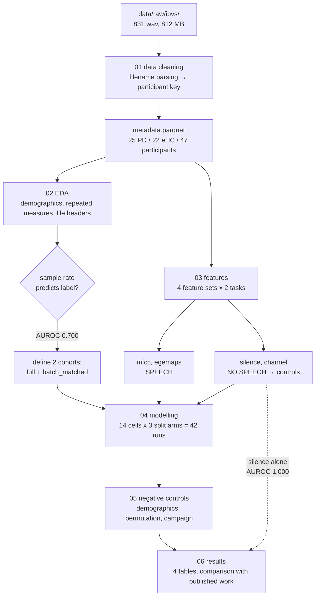

# Method — how the result was reached

A stage-by-stage record of what was run, what was computed, and which decisions
were changed along the way. Read `FINDINGS.md` for the conclusions; this document
is the process behind them.

## Flow



## Environment

Python 3.11 in `.venv`, every version pinned in `requirements.txt`. Deliberately
no PyTorch, no transformers, no MLflow, no DVC: the question at hand needs none of
them, and adding representation power to a corpus whose validity is unverified
only produces a more confident wrong answer.

| library | version | used for |
|---|---|---|
| numpy / pandas | 2.1.3 / 2.2.3 | arrays, tabular joins, parquet |
| scikit-learn | 1.5.2 | `StratifiedGroupKFold`, `RandomForestClassifier`, `LogisticRegression`, `roc_auc_score` |
| librosa | 0.10.2 | resampling, MFCC, `effects.split` for silence detection, STFT |
| soundfile | 0.12.1 | WAV header inspection without decoding |
| opensmile | 2.5.0 | eGeMAPSv02 functionals |
| praat-parselmouth | 0.4.5 | installed for Phase 1 perturbation measures; unused in Phase 0 |
| scipy | 1.14.1 | Welch *t*-test, Fisher exact, Mann–Whitney |
| matplotlib / seaborn | 3.9.3 / 0.13.2 | figures |
| jupytext | 1.16.4 | `scripts/*.py` ↔ `notebooks/*.ipynb` pairing |
| pytest | 8.3.4 | 24 tests |

Two environment variables are set by the `Makefile` because their absence causes
a confusing per-file failure rather than an import error: `NUMBA_CACHE_DIR` (set
inside `src/features.py` before `import librosa`) and `MPLCONFIGDIR`.

Runtime on an M3 Pro: `make all` ≈ 10 minutes, `make notebooks` ≈ 9 minutes.

---

## Stage 01 — Data cleaning

**Input** 831 `.wav` files in three group directories.
**Code** `src/parsing.py`, `scripts/01_data_cleaning.py`.
**Output** `data/processed/metadata.parquet` (28 columns), `metadata_public.parquet`.

### The problem to solve

The corpus ships **no participant identifier**. It ships one directory per
recording session, named with the participant's real first name and surname
initial. Every downstream number depends on getting "who is this person" right,
and getting it wrong fails silently.

### Computation

Each filename is parsed with one regular expression:

```
^(?P<task_base>[A-Z]+)(?P<task_rep>\d+)(?P<code>[A-Za-z_ ]+?)
 (?P<birth_year>\d{2})(?P<sex>[MF])(?P<stamp>\d+)\.+wav$
```

Three details were forced by real filenames, each found by a check that fails
rather than by inspection:

- `[A-Za-z_ ]` not `[A-Za-z]` — one participant's code contains an underscore, another a space.
- `\d+` not `\d` for the task index — one file is `PR11...`.
- `\.+wav` — one file has a doubled dot before the extension.

Derived quantities:

| quantity | rule | why not the obvious thing |
|---|---|---|
| `code_signature` | letters of the name code, lowercased and **sorted** | the scrambling is not stable across sessions: `rriovbie` and `RROIBVEI` are the same person |
| `session_date` | `stamp[:-4]` | the stamp is `ddmmyy` or `ddmmyyyy` plus `hhmm`; ranking on the full stamp makes every recording its own session |
| `birth_year` | **majority vote within directory** | see below |
| `subject_key` | `code_signature \| birth_year \| sex` | see below |
| `age` | `2017 − (1900 + birth_year)` | no participant born after 1999 |
| `subject_id` | `PD01`…, ordered by SHA-256 of the key | a hash ordering does not leak alphabetical position of the real name |

### Why the birth year is neither dropped nor trusted

This took two wrong attempts.

**Attempt 1** — key on `code_signature + birth_year + sex`. Result: 26 patients,
one of whom owns a single recording. Cause: `VI2AGNUTGOL63F...` sits among fifteen
`...52F...` files from the same session. One mistyped digit had invented a patient.

**Attempt 2** — drop the birth year, key on `code_signature + sex`. Result: two
elderly controls in separate directories merged into one. Cause: `VAILTFOO49M`
and `VLIATFOO55M` are **anagrams**, so sorting the letters makes them collide.
The birth year is the only thing separating two different people.

**Final rule** — resolve the birth year to the majority value *within each
directory*, then key on it. A typo is a minority variant inside one session; two
different people occupy two different directories. Both cases are then handled,
and both are covered by tests (`test_directory_scoped_typo_does_not_fork_a_participant`,
`test_anagram_controls_are_not_merged`) built on a synthetic corpus of empty files.

### Result

| group | directories | participants | recordings |
|---|---|---|---|
| PD | 28 | **25** | 437 |
| elderly control | 22 | 22 | 349 |
| young control | 15 | not identifiable | 45 |

Three patients are filed under two directories each. Young controls collapse from
15 directories onto 3 name codes with sex encoded as `M` throughout, including
two directories with unambiguously female names — no usable key exists for them,
and they are excluded along with two other independent reasons (age 19–29 against
a patient range of 40–80; only 2 of 9 tasks performed).

### Assertion that stops the pipeline

```python
assert not unparsed, "...Fix the regex rather than dropping them."
```

Currently 831 / 831 parse. A recording silently dropped here would be a recording
missing from the analysis for no recorded reason.

---

## Stage 02 — Exploratory analysis

**Purpose** not to look for signal, but to enumerate what could produce signal
other than the disease.
**Output** `audio_stats.parquet`, figures 1–5.

### Computed

| quantity | method | result |
|---|---|---|
| age difference | Welch *t*-test | *t* = −0.14, **p = 0.892** — matched |
| sex difference | Fisher exact | **p = 0.248** — 64% vs 46% male, not balanced |
| duration difference | Mann–Whitney *U* | read passage, by group |
| agreement between a participant's two readings | Pearson *r* on duration | **r = 0.961** |
| container properties | `soundfile.info` — no audio decoded | see below |

The `r = 0.961` is the quantitative justification for participant-level splitting:
the two readings are not independent observations.

### The unplanned finding

`soundfile.info` reads the WAV header without decoding a sample. Cross-tabulating
sample rate against group:

| campaign | sample rate | PD | control |
|---|---|---|---|
| 2016 | 44.1 kHz | 10 | **0** |
| 2017 | 16 kHz | 18 | 22 |

Sample rate alone, as a single binary feature, gives participant-level
**AUROC 0.700**. That is a diagnosis from file metadata, before any audio is
decoded.

This forced a change to the design: every subsequent result is reported on **two
cohorts**, `full` (25/22) and `batch_matched` (2017 only, single sample rate,
18/22).

---

## Stage 03 — Feature extraction

**Output** 7 parquet tables in `data/processed/features/`, `univariate_auroc.parquet`.

All audio is loaded at **16 kHz mono** and peak-normalised, so the 44.1 kHz files
are not separable by rate alone.

| feature set | count | computation | contains speech |
|---|---|---|---|
| `mfcc` | 40 | mean and SD of 20 MFCCs over the whole recording | yes |
| `egemaps` | 88 | eGeMAPSv02 functionals via openSMILE | yes |
| `silence` | 41 | MFCCs of the **complement** of `librosa.effects.split(top_db=30)` | **no** |
| `channel` | 8 | level, noise floor, SNR, DC offset, spectral tilt, clipping | **no** |

The two controls are the point of the study, not an afterthought. `silence`
inverts the speech mask and keeps only what a normal pipeline throws away.
`channel` is eight numbers describing the recording chain:

```
ch_peak, ch_silence_db, ch_speech_db, ch_snr_db,
ch_dc_offset, ch_lf_ratio (<625 Hz), ch_hf_ratio (>6.25 kHz), ch_clipped_fraction
```

with `db(x) = 20·log10(RMS(x) + 1e-12)` and the ratios taken from a normalised
512-point STFT magnitude spectrum averaged over frames (31.25 Hz per bin).

### Handling of extractor failures

`silence_features` returns `None` when fewer than 250 ms of non-speech exists;
`channel_features` returns `None` below 100 ms. A `None` drops that recording from
that table and prints it. Nothing is imputed. This is why `vowel_a__channel` has
78 rows rather than 99: twenty-one sustained vowels contain no measurable pause.

Five assertions run over every table — no NaN, no constant column, no duplicate
`(participant, task, repetition, session)`, both classes present, one label per
participant. They caught two real bugs during development: a numba cache failure
that silently emptied three tables, and NaN noise-floor values on continuously
phonated vowels.

### Univariate screen

For every feature, `max(AUROC, 1 − AUROC)` at recording level, on both cohorts.
This is a cheap way to notice a feature that is too good before it is inside a
model.

| task | feature set | full | batch-matched |
|---|---|---|---|
| read passage | **silence** | **1.000** | **1.000** |
| read passage | egemaps | 0.998 | 1.000 |
| read passage | mfcc | 0.998 | 1.000 |
| read passage | channel | 0.869 | 0.906 |
| vowel /a/ | egemaps | 0.937 | 0.990 |
| vowel /a/ | mfcc | 0.852 | 0.926 |
| vowel /a/ | channel | 0.740 | 0.822 |

A single MFCC coefficient of the **silence**, `sil_mfcc05_mean`, reaches AUROC
1.000. Restricting to one campaign and one sample rate does not reduce it — so
the confound is not the sample rate. Consistent with a microphone or distance
difference, patients carry 0.70 of spectral energy below 625 Hz against 0.57 for
controls (AUROC 0.906) and roughly half the high-frequency energy.

---

## Stage 04 — Modelling and evaluation

One notebook, because the evaluation *is* the outer cross-validation loop.

**Estimator** `Pipeline([StandardScaler, RandomForestClassifier(n_estimators=100, random_state=42)])`
at library defaults, **not tuned**. Tuning would confound the comparison; the
question is not how high the number goes but what it means. Scaling sits inside
the pipeline so it is fitted on training folds only.

**Grid** 14 cells × 3 arms = **42 runs**, each 5 folds × 5 repeats.

### The three split arms

Identical features, identical estimator, identical seeds. Only the grouping key
differs.

| arm | grouping key | held-out recordings whose participant is also in training |
|---|---|---|
| `A_recording` | none (`StratifiedKFold`) | **85.53%** |
| `B_folder_path` | directory path | 9.36% |
| `C_subject_key` | verified participant | **0%** |

Measured directly by `src/splits.leakage_report`, and asserted in the notebook
before any AUROC is read:

```python
assert leak_table.loc["C_subject_key", "folds_with_leakage"] == 0
assert leak_table.loc["A_recording",  "folds_with_leakage"] > 0
```

Arm B is the realistic mistake: it *looks* like a participant-level split and
leaks only through the three patients recorded twice.

### Evaluation rules

Two rules are enforced in `src/metrics.py` rather than left to the caller, because
either one done wrong silently narrows the reported interval.

1. **Participant-level scoring.** Out-of-fold probabilities are averaged per
   participant *before* scoring:
   `score(p) = mean(p̂ᵢ : recording i belongs to p)`, `label(p) = max(yᵢ)`.
   A participant contributes one row, not two.
2. **Bootstrap resamples participants.** 2000 draws with replacement over
   participants, percentile interval at α = 0.05. Resampling *recordings* would
   treat a participant's two readings as independent and produce intervals far too
   narrow. Resamples that end up single-class return `NaN` and are dropped rather
   than scored as 0.5.

Per-repeat out-of-fold predictions are averaged across the 5 repeats before
scoring; each repeat is a complete partition, so this averages unbiased
predictions rather than reusing a fold.

### Comparing arms

`bootstrap_paired_delta` — 2000 paired resamples of the participants **common to
both arms**, so the difference is attributable to the split and not to a different
sample. Two-sided bootstrap p-value from how often the resampled difference
crosses zero. DeLong was not used: the two arms differ in how predictions were
produced, not merely in a score column, and a paired participant resample makes no
parametric assumption about that.

### Main result, participant-level AUROC, arm C

Read passage:

| feature set | speech | full (n=46) | batch-matched (n=39) |
|---|---|---|---|
| silence | **no** | 1.000 [1.000, 1.000] | **1.000 [1.000, 1.000]** |
| channel | **no** | 0.890 [0.787, 0.964] | 0.897 [0.772, 0.987] |
| mfcc | yes | 0.987 [0.948, 1.000] | 1.000 [1.000, 1.000] |
| egemaps | yes | 0.990 [0.961, 1.000] | 1.000 [1.000, 1.000] |

Sustained vowel, batch-matched: egemaps 0.995, mfcc 0.929, channel 0.874.

Δ AUROC between arm A and arm C is **0.000** for mfcc and egemaps. That is a
ceiling effect, not evidence that the split is harmless — the confound already
saturates performance, so leakage has no room to add anything. Leakage becomes
measurable only in stage 05.

### Training diagnostics

A random forest has no per-epoch loss curve, so three other diagnostics are
computed, on the `channel` feature set because with MFCC every panel is pinned at
1.000:

1. **Per-fold optimism** — training AUROC against held-out AUROC for all 75 folds.
   Training is pinned at 1.000 (a default-depth forest memorises its training set)
   while held-out spans 0.63–1.00. A single train/test split would have shown one
   point from that spread.
2. **Out-of-bag error against forest size** — 10 to 500 trees. Channel plateaus
   around 0.10, MFCC at 0.000. Forest size is not the limitation.
3. **Learning curve by participant count.** `sklearn.learning_curve` was *not*
   used: it subsamples rows, which would place one reading in the training subset
   and the other in the test fold. Instead the training subset is drawn at
   participant level *inside* an already participant-disjoint fold. MFCC reaches
   **held-out AUROC 0.999 with 12 training participants**. No genuine clinical
   discrimination task saturates that fast.

---

## Stage 05 — Negative controls

A negative control is an experiment whose answer is known in advance if the
pipeline is sound.

| control | method | expected | observed |
|---|---|---|---|
| demographics only | logistic regression on age + one-hot sex, arm C | ≈ chance | 0.618 [0.431, 0.802] — **as expected** |
| campaign within patients | arm C, PD only, target = 2016 vs 2017, dual-campaign patients excluded | ≈ chance | 0.352 [0.111, 0.614] — **inconclusive** |
| label permutation, arm C | 500 shuffles at participant level | centred on 0.5 | mean 0.447, p95 0.647 — **as expected** |
| label permutation, arm A | 500 shuffles at participant level | centred on 0.5 | **mean 0.882** |
| silence only | from stage 04 | ≈ chance | **1.000** |

### Permutation test detail

Labels are shuffled **at participant level**, so the null preserves the fact that a
participant's recordings share a label. Shuffling per recording would destroy that
structure and produce a null that is too easy to beat. The p-value uses the +1
correction, `p = (#{null ≥ observed} + 1) / (n + 1)`, so it can never be exactly
zero; with 500 permutations the floor is 0.002.

### Why the campaign control is reported as inconclusive

Excluding the three patients recorded in both campaigns leaves 22 patients split
roughly 8 / 14. The interval spans chance in both directions, so it cannot
establish that no campaign signature exists. Its value is to redirect the
explanation: stage 03 already showed that restricting to one campaign and one
sample rate leaves the silence control at 1.000. If the acquisition difference
were a property of the *year*, that restriction would have removed it. It did not.
So the difference tracks the **group** — patients and controls were recorded under
different conditions within the same campaign.

### Why arm A's permutation null is the answer to RQ1

With random labels, a recording-level split still reports **AUROC 0.882**, because
the model recognises the participant across their two readings and recalls
whichever label they were given. A participant-level split reports 0.447. This is
the quantity a published recording-level number cannot be distinguished from, and
it is the leakage effect that the main grid could not show because of the ceiling.

---

## Stage 06 — Results

Assembles four tables (`results/table1..4`) and the summary figure, and places
the numbers next to Klempír, Krupička & Krupil (2024), *Sensors* 24(17):5520 —
same corpus, random forest, MFCC-style features, accuracy 0.85–0.95, 5-fold CV
with grouping not stated, no negative controls.

Our arm-C AUROC of 0.99 is **higher** than the published accuracy. Read as a
leaderboard entry that is an improvement; read against the silence control in the
same table it is a measurement of how strong the confound is.

---

## Decisions reversed during the work

Recorded because the reasoning matters more than the final code.

| decision | changed to | trigger |
|---|---|---|
| SMOTE inside the pipeline | no resampling at all | van den Goorbergh et al. 2022 (*JAMIA*): drives the calibration intercept from 0.06 to −1.32/−1.50 with no AUROC gain |
| `session_index` from the full timestamp | from the date only | every recording became its own session |
| participant key includes raw birth year | majority vote within directory | one typo invented a 26th patient |
| participant key drops birth year | majority vote within directory | two anagram controls merged into one person |
| headline = "leakage inflates results" | headline = acquisition confound | silence-only control returned 1.000 |
| single cohort | two cohorts | sample rate alone gave AUROC 0.700 |
| diagnostics on MFCC | diagnostics on channel features | every MFCC panel was pinned at 1.000 and unreadable |
| notebook outputs printed directory names | anonymised to `dir-33ef9b` tokens | committed `.ipynb` contained real patient names beside the diagnosis |

## Tests

24 tests in `tests/test_no_leakage.py`, none requiring the corpus except two that
skip without it.

- **Parsing** — six irregular filenames observed in the real corpus; order-insensitive
  code signature; anagram codes separable only by birth year; session date drops the
  time of day.
- **Split integrity** — arm C never shares a participant; arm A *does* (if this ever
  passes, the experiment has lost its contrast); arm B leaks only the two-session
  participant; every recording is tested exactly once per repeat.
- **Metric integrity** — aggregation collapses to one row per participant; inconsistent
  labels raise; the bootstrap interval widens as participants decrease; single-class
  resamples return NaN.
- **Privacy** — `redact` removes every identifying column; `anonymise_directories`
  removes names while preserving collision structure; and a scan of the committed
  `notebooks/*.ipynb` and `results/*.csv` for every participant directory name. That
  last test failed once, on a stale notebook, which is what it exists for.

## Reproducing

```bash
make test        # 24 tests, no corpus needed
make all         # pipeline as scripts, ~10 min
make notebooks   # same, executing every cell into notebooks/*.ipynb, ~9 min
make sync        # propagate edits between scripts/ and notebooks/ without running
```

Everything is seeded: `seed=42`, 5 folds × 5 repeats, 2000 bootstrap draws, 500
permutations. A clean run from a deleted `data/processed`, `results` and `figures`
reproduces every figure in this document identically.
