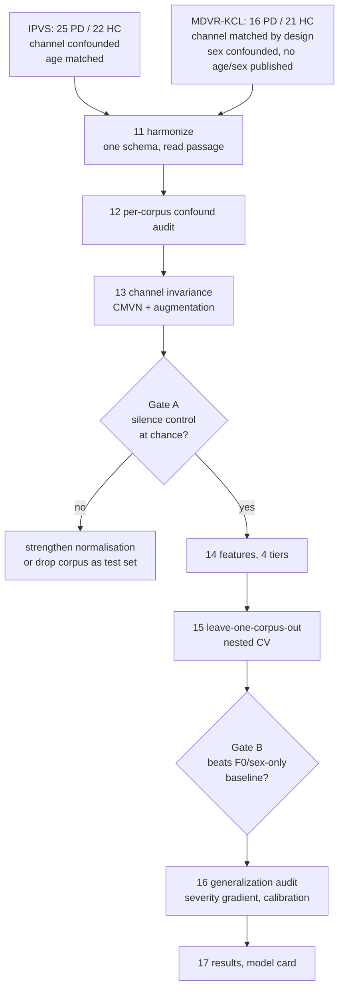

# Phase 1 — A cross-corpus Parkinson's voice classifier that survives its own controls

## Goal and honest expectation

Produce a model plus a **generalization estimate that is defensible**: trained on one corpus, tested on a corpus it has never seen, with the acquisition shortcut removed before training and every negative control reported next to the headline number.

Expected outcome: **AUROC 0.65–0.82 with a 95% CI roughly ±0.12**. Anything near 0.95 would be a red flag, not a win — that is the lesson Phase 0 paid for. The deliverable is a validated model _and_ an honest interval, or a documented reason the free data cannot support one.

## Why this design, given the data we can actually get

You have no institutional affiliation, so NeuroVoz (Zenodo restricted) and PC-GITA (author request) are out. That leaves two corpora, and their confounds run in **opposite directions** — which is exactly what makes cross-corpus validation informative here.

- **IPVS** (local, 25 PD / 22 eHC): acquisition confound proven in Phase 0 — silence alone gives AUROC 1.000. Age is well matched (66.8 vs 67.1). Sex mildly skewed (64% vs 46% male). Italian, read passage twice, plus vowels and DDK.
- **MDVR-KCL** ([Zenodo 2867216](https://doi.org/10.5281/zenodo.2867216), free, no DUA, 16 PD / 21 HC): acquisition **matched by design** — one Motorola Moto G4, one 10 m² room, 0.5 s reverb, a single 4-day window in Sept 2017, both groups. But **severe sex confound**: PD 11M/5F vs HC 2M/19F, so sex alone reaches AUROC ≈ 0.80. Age and sex are **not published per participant**. English, "The North Wind and the Sun" plus spontaneous dialogue.

A channel shortcut learned on IPVS cannot transfer to a phone-held-to-the-ear recording, so cross-corpus testing defeats it. Sex, however, skews the same way in both, so it must be attacked directly rather than left to the split.

Shared task across both corpora: **read passage only** (different languages — a real limitation, and the reason to prefer features that do not depend on phonetic content).



## Stage 0 — Branch

Phase 0 is still uncommitted on `feat/phase0-leakage-audit` (15 pending items). Commit it first with your approval, then branch `feat/phase1-cross-corpus` from it. Phase 1 reuses `src/parsing.py`, `src/splits.py`, `src/metrics.py`, `src/experiment.py`, `src/viz.py` unchanged.

## Stage 10 — Acquire MDVR-KCL

New `scripts/10_acquire_mdvr_kcl.py` and `src/corpora.py`.

Download from Zenodo into `data/raw/mdvr_kcl/` (gitignored, same rules as IPVS), record the DOI, file count, and a SHA-256 manifest in `docs/DATASET_VERSION.md`. Expected layout:

```
ReadText/HC/ID{NN}_hc_{HY}_{U2-5}_{U3-18}.wav      21 files
ReadText/PD/ID{NN}_pd_{HY}_{U2-5}_{U3-18}.wav      16 files
SpontaneousDialogue/{HC,PD}/                        21 + 15 files
```

Parse `ID`, label, Hoehn & Yahr, UPDRS II-5, UPDRS III-18. Note the documented oddities up front: HC `ID31` carries UPDRS ratings of 1, and some PD carry 0 — the labels are clinical diagnosis, not voice severity.

## Stage 11 — Harmonize into one schema

New `scripts/11_harmonize_corpora.py`, `src/corpora.py` with one loader per corpus returning a common frame:

`corpus, subject_id, label, task, task_rep, language, age, sex, severity, path`

`age` and `sex` are `NaN` for MDVR-KCL and that must stay visible, never imputed. Restrict the modelling task to `read_passage`. Extend `src/splits.py` with a fourth arm, `D_leave_one_corpus_out`, grouped by `corpus` — and add a test asserting no participant and no corpus crosses the boundary.

## Stage 12 — Per-corpus confound audit

New `scripts/12_eda_cross_corpus.py`. Runs the Phase 0 controls **separately on each corpus** and characterises the domain shift between them.

- Silence-only and channel-statistics AUROC per corpus. Prediction: IPVS fails, MDVR-KCL passes. If MDVR-KCL also fails, the field has a systematic problem and the paper changes shape again.
- **F0-only baseline as the sex proxy.** Since MDVR-KCL publishes no sex, mean F0 (parselmouth) stands in for it — male roughly 100–130 Hz, female 180–220 Hz. This becomes a mandatory control exactly like the silence control.
- Domain shift: effective bandwidth, reverberation, noise floor, level distribution, duration. Two very different channels is the _point_, but it must be quantified.

## Stage 13 — Channel invariance (the load-bearing new work)

New `src/normalize.py`, `scripts/13_channel_invariance.py`.

Phase 0 showed the IPVS confound is a **stationary spectral tilt** (0.70 vs 0.57 of energy below 625 Hz). A time-invariant linear channel is multiplicative in the spectrum, therefore **additive and constant in the cepstrum** — so per-recording cepstral mean and variance normalization removes it exactly.

Three mechanisms, each validated by re-running the silence control:

1. **CMVN** per recording on MFCC and log-mel.
2. **Channel augmentation** during training only: random spectral tilt, gain, band-limiting, additive noise at sampled SNR, simple RIR convolution. Makes channel cues unreliable rather than merely removed.
3. **Noise-floor equalisation** — match the silence RMS across recordings before feature extraction.

Success criterion for this stage: **silence-only AUROC drops to ≤ 0.65** on IPVS. If it does not, the confound is not convolutive, and IPVS may be used only as a training corpus, never as a test corpus.

## Stage 14 — Features, four tiers, channel-robust first

Extend `src/features.py`.

- **Tier A, physiological and ratio-based** (most channel-robust, best clinical justification): jitter, shimmer, HNR via parselmouth; F0 mean, SD, range; speech rate; pause count, mean pause duration, pause ratio; voiced/unvoiced ratio. Ratios cancel a multiplicative channel; timing measures are immune to it.
- **Tier B, CMVN-MFCC** — 40 features, the Phase 0 set with normalization applied.
- **Tier C, eGeMAPSv02** with the absolute-level parameters flagged and reported separately from the relative ones.
- **Tier D, frozen wav2vec2-base** (free, local, MPS, no fine-tuning), mean-pooled, per-recording standardised. Klempír 2024 found wav2vec transferred cross-database better than MFCC, so it is worth testing — but only after Gate A passes, and **the same embeddings must be extracted from the silence segments and reported**, because Klempír's own Figures 6–7 show these embeddings encode age, sex and "loud region duration".

## Stage 15 — Modelling with leave-one-corpus-out nested CV

New `scripts/15_cross_corpus_model.py`.

Outer loop is **leave-one-corpus-out** — only two folds, which is the honest reality of two corpora: train IPVS, test MDVR-KCL, and the reverse. Inner loop is `StratifiedGroupKFold(3)` grouped by subject **within the training corpus only**, scored on `neg_log_loss`, never accuracy or F1.

Estimators, all free and local, all appropriate to n < 50 per group:

- `LogisticRegression` with L2 and with elastic net — the right default at this sample size, and calibrated by construction
- `XGBoost` with shallow trees and strong regularization
- `RandomForestClassifier` as the Phase 0 continuity baseline

No SMOTE, no resampling — van den Goorbergh et al. 2022 (_JAMIA_). Class balance handled by threshold selection.

Also report the within-corpus participant-level number for each corpus, so the **within-corpus versus cross-corpus gap** is explicit. Hires et al. found exactly this drop; Klempír's cross-database result was a single split with no CI, which we replace with a proper interval.

## Stage 16 — Generalization and overfitting audit

New `scripts/16_generalization_audit.py`.

- **Severity gradient — the strongest validity check available for free.** Both corpora carry severity: MDVR-KCL has Hoehn & Yahr and UPDRS II-5 / III-18 in the filenames, IPVS has severity bins in its directory structure. Does the model's predicted probability rise with severity? A channel or sex shortcut has no reason to track UPDRS. If the correlation is there, that is positive evidence the model measures something clinical.
- Learning curve by participant count; per-fold train-versus-held-out gap; permutation null under both the LOCO and the participant-level split.
- **Calibration**: reliability curve, Brier score with Murphy decomposition, ECE.
- **Prior correction** to real prevalence, `logit_corrected = logit_raw + log(pi_real/(1-pi_real)) - log(pi_train/(1-pi_train))`, then PPV at 1–2% prevalence. At 90% sensitivity and 90% specificity, PPV at 1% is 8.3% — any screening framing must state this.
- **Decision curve analysis**: net benefit against treat-all and treat-none.
- **Sex sensitivity analysis.** The one stratum where sex is constant and both corpora contribute is female: IPVS 9 PD / 12 HC and MDVR-KCL 5 PD / 19 HC. Underpowered but confound-free, and reported as such. The male stratum is unusable — MDVR-KCL has only 2 male controls.

## Stage 17 — Results and model card

New `scripts/17_results_phase1.py`. Comparison table against Klempír 2024 and Hires et al., a TRIPOD+AI-shaped write-up, a model card, and `results/phase1_*.csv`. Persist the fitted model with `joblib` only if Gates A and B both pass.

## Acceptance gates

- **Gate A, per corpus.** Silence-only and channel-only AUROC ≤ 0.65 after normalization. Below this, the corpus cannot serve as a test set.
- **Gate B, cross-corpus.** LOCO participant-level AUROC with a CI whose lower bound exceeds the F0-only and demographics-only baselines.
- **Gate C, clinical honesty.** Calibration reported, prior-corrected PPV stated, severity gradient reported whether or not it is favourable.

## What ships in either case

If the gates pass: a model with a cross-corpus AUROC and CI, calibration, a severity gradient, and a model card — which is more than the benchmark paper reports.

If they fail: a documented negative result naming the specific blocker, plus a reusable confound-audit harness and a concrete data specification for what a usable corpus would look like. Phase 0 already showed this is a publishable outcome.

## Known risks, stated up front

- **Two corpora means a two-fold outer loop.** No way around it with free data; the interval will be wide and must be reported as such.
- **MDVR-KCL's sex confound is severe and its demographics are unpublished.** F0 as a proxy is a workaround, not a fix.
- **Cross-lingual transfer** (Italian to English) confounds language with corpus. Tier A features are chosen partly because they are least sensitive to phonetic content.
- **CMVN may not be enough.** It removes convolutive channel effects only; a noise-floor or nonlinear difference survives it.
- **41 PD participants total** caps the achievable precision regardless of method.
